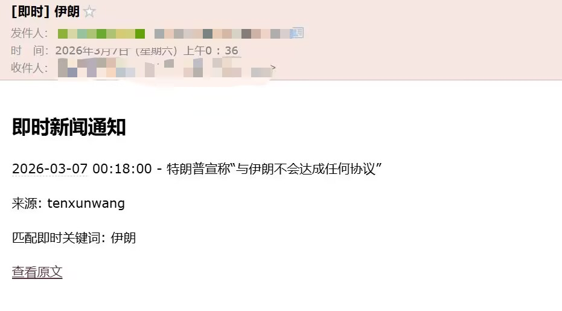
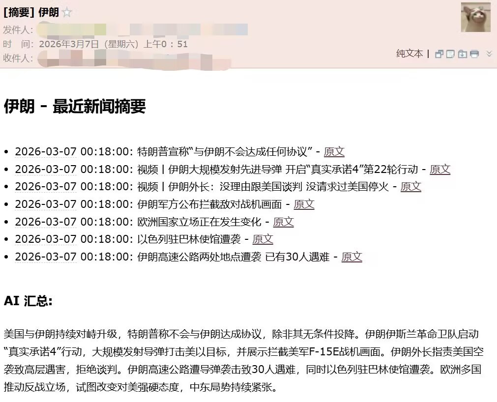
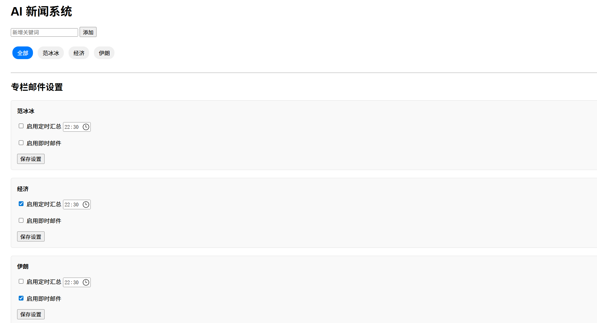
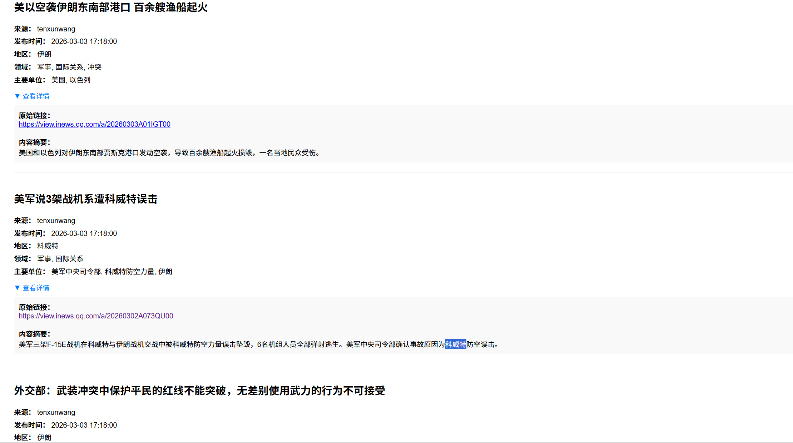

# AI 智能新闻监测与自动推送系统

基于 FastAPI + SQLAlchemy + Redis + Ollama LLM + APScheduler 构建的 AI 智能新闻监测与自动推送系统。

系统能够自动抓取新闻 → 通过大模型进行结构化抽取 → 根据关键词分类入库 → 实现即时邮件提醒与每日摘要邮件推送 → 提供 Web 可视化管理界面。

---

## 📌 项目特性

- 📰 **自动抓取新闻 API**
- 🤖 **本地 LLM 结构化抽取**（Ollama）
- 🗂 **普通关键词专栏分类**
- ⚡ **即时关键词邮件提醒**
- 📩 **每日定时摘要邮件**（AI 汇总）
- 🔁 **Redis 三日去重机制**
- 🌐 **Web 可视化管理界面**

---

## 邮件通知示例

### 即时通知



### 每日摘要




### 关键词设置



### 新闻示例




## 🧠 AI 在系统中的作用

大模型负责：

- 领域识别
- 地区抽取
- 主要单位抽取
- 新闻内容摘要
- 普通关键词匹配
- 即时关键词匹配
- 每日专栏整体摘要生成


---

## 🛠 技术栈

| 组件 | 技术 |
|------|------|
| Web 框架 | FastAPI |
| ORM | SQLAlchemy |
| 数据库 | SQLite / MySQL |
| 缓存 | Redis |
| LLM | Ollama（本地大模型） |
| 定时任务 | APScheduler |
| 邮件系统 | SMTP |
| 模板引擎 | Jinja2 |

---

## 📂 项目结构
.
├── app.py # FastAPI Web服务
├── auto_pipeline.py # 新闻抓取与分析主程序
├── scheduler.py # 定时摘要调度
├── database.py # 数据库模型定义
├── fetch_news.py # 新闻API抓取
├── mail_utils.py # 邮件发送模块
├── config.py # 配置文件
├── templates/ # 前端页面模板
└── requirements.txt # 项目依赖


---

## ⚙️ 环境要求

- Python 3.10+
- Redis
- Ollama
- 支持 SMTP 的邮箱（如 QQ 邮箱）

---

## 🔧 安装步骤

### 1️⃣ 克隆项目

```bash
git clone https://github.com/yourname/ai-news-tracking.git
cd ai-news-tracking
```
###  2️⃣ 安装依赖
```bash
pip install -r requirements.txt
```
###  3️⃣ 配置 config.py
```bash

DATABASE_URL = "数据库路径"
API_URL = "https://orz.ai/api/v1/dailynews/?platform=tenxunwang"
OLLAMA_MODEL = "ollama部署的大模型名称"

EMAIL_HOST = "smtp.qq.com"
EMAIL_PORT = 465
EMAIL_USER = "你的邮箱"
EMAIL_PASSWORD = "邮箱授权码"
EMAIL_TO = "接收邮箱"
```
###   4️⃣ 启动 Redis
```bash
redis-server
```
###   5️⃣ 启动 Ollama
```bash
ollama run qwen3:8b
```
###   6️⃣ 启动 Web 服务
```bash
python app.py
访问：http://127.0.0.1:8000
```

###   7️⃣ 启动新闻抓取服务
```bash
python auto_pipeline.py
系统将每 30 分钟自动抓取并分析新闻。
```
---
##  🔁 去重机制
使用 Redis 实现三日去重：

news:hash:{hash} —— 新闻入库去重

news:immediate:{hash}:{keyword} —— 即时邮件去重

避免重复入库和重复通知。

##  📩 即时通知逻辑
当新闻：

匹配 Redis 中的即时关键词

且数据库中该关键词 enable_immediate = True

立即发送邮件提醒。

##  🕒 定时摘要机制
每分钟检查一次

达到关键词设定时间自动发送

汇总最近 24 小时新闻

使用 LLM 生成专栏整体摘要

##  🌐 Web 管理功能
新闻分页浏览

按关键词筛选

新增关键词

删除关键词

配置摘要时间

开启/关闭即时通知

手动触发摘要发送
